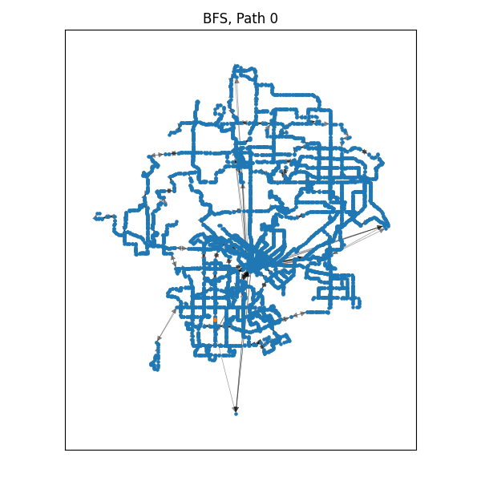

# DART Network Analysis

<!-- markdownlint-disable-next-line -->
#### DCNS S23 - Project

Andrew Glick, David Simpson

## Description

Final project for UTD SYSM 6302 / MECH 6317 S23.

We were interested in exploring local public transportation through the DART bus
network as well as investigating pathfinding algorithms.

> Data obtained from: www.dart.org/transitdata/latest/google_transit.zip
> See also: DART GTFS data on [MobilityData/mobility-database-catalogs](https://github.com/MobilityData/mobility-database-catalogs/blob/c74327f4a4955ee0189f261478fb04807c067334/catalogs/sources/gtfs/schedule/us-texas-dallas-area-rapid-transit-dart-gtfs-152.json#L4)

## Running the Code

1. Install Python 3.9 and [Poetry](https://python-poetry.org/docs/#installation)
2. Run `poetry install` in the command line. Note: if Python 3.9 is not your
   default Python intrepreter, you may need to first run `poetry env use
   path/to/python3.9`
3. Run `dcns/parse_data.py` to create GML files from the GTFS data or look at
   `dart_graph.ipynb` for the analysis.

---

## What is our network?

- **Nodes:** Bus stops
- **Directed Edges:** Bus trips
- **Weights:** Trip duration OR number of trips

---

## General Transit Feed Specification (GTFS)

- GTFS is a standard used by public transit agencies to publish their transit data
- Important files `routes.txt`, `trips.txt`, `stops.txt`, `stop_times.txt`

Combining this yields a graph with many trips between each node. We can assign
weights based on either average trip time or the total number of trips.

> `stops.txt` includes the bus stop latitude/longitude. This does not directly
> translate to X/Y coordinates, but we will assume a flat earth for convenience.

---

## Components

- There are 6 components
- Analysis was performed on the largest component

---

## What about modeling crossing the street?

It is not practical for a passenger to have to ride the bus all the way to a
central bus stop if they want to go the other way. We modeled this by adding
edges between pairs of nodes that were within a certain threshold of each other.

Unsurprisingly, this increases the number of edges and decreases the diameter of
the graph.

---

## Degree Distribution

The bus stops follow the power law, with most bus stops having only 1 "input"
and 1 "output". Adding close edges shifts most nodes to having a degree of 4.

---

## Centrality

| Degree              | Eigenvector          | Katz   ($β/α=10$)        | Betweenness                         |
|---------------------|----------------------|------------------------|-------------------------------------|
| Elm / Akard, 4308   | Elm / Lamar, 0.49    | Elm / Field, 0.077     | Addison Transit Center, 0.243                   |
| Elm / Field, 4308   | Elm / Griffin, 0.443 | Elm / Griffin, 0.076   | South Garland Transit Center, 0.186             |
| Elm / Griffin, 4258 | Elm / Field, 0.369   | Elm / Lamar, 0.073     | Moody / Feral, 0.175                |
| Elm / Lamar, 4092   | CBD West TC, 0.245   | Elm / Akard, 0.071     | SW Medical District/Parkland, 0.171 |
| Elm / Evray, 3980   | Elm / Austin, 0.241  | Commerce / Lane, 0.067 | Commerce / Field, 0.168             |

- High centrality nodes are located in Downtown Dallas
- Nodes with high betweenness centrality are transit centers which makes a lot of sense.

---

## Clustering

---

## Pathfinding

We investigated Breadth-First Search (BFS), Dijkstra's Algorithm, and the A* algorithm with real-world distance as the heuristic.

### Algorithm Comparison

|             | BFS             |                |   |             | Dijkstra        |                |   |             | A\* (dist\*1e5)   |                |
|:-----------:|:---------------:|:--------------:|:---:|:-----------:|:---------------:|:--------------:|:---:|:-----------:|:---------------:|:--------------:|
| Path length | Trip time (sec) | Nodes searched |   | Path length | Trip time (sec) | Nodes searched |   | Path length | Trip time (sec) | Nodes searched |
| 117         | 7317.49         | 4454           |   | 117         | 5244.56         | 3891           |   | 117         | 5244.56         | 856            |
| 78          | 6359.12         | 4454           |   | 78          | 4948.49         | 4237           |   | 139         | 5858.44         | 878            |
| 62          | 3306.62         | 3768           |   | 62          | 3306.62         | 3176           |   | 62          | 3306.62         | 785            |
| 74          | 4023.59         | 1497           |   | 74          | 3983.81         | 1531           |   | 74          | 3983.81         | 191            |
| 77          | 3385.24         | 4470           |   | 77          | 3255.68         | 3067           |   | 83          | 3927.2          | 1193           |

| BFS | Dijkstra | A\* |
|:-:|:-:|:-:|
| |  |  |

Comments:

- Row 0: Has decrease in nodes searched from left to right which is good
- Row 1: Increase from Dijkstra to A\* which is odd
- Row 2: Same as row 1
- Row 3, D+A found shorter path of the same length than BFS

---

### Effects of Close Edges (A\*)

|             | Without close edges |                |   |             | With close edges |                |
|:-----------:|:-------------------:|:--------------:|:---:|:-----------:|:----------------:|:--------------:|
| Path length | Trip time (sec)     | Nodes Searched |   | Path length | Trip time (sec)  | Nodes Searched |
| 117         | 5244.56             | 3891           |   | 32          | 2152.69          | 2010           |
| 78          | 4948.49             | 4237           |   | 31          | 2132.69          | 1984           |
| 62          | 3306.62             | 3176           |   | 16          | 633.14           | 78             |
| 74          | 3983.81             | 1530           |   | 32          | 2077.99          | 669            |
| 81          | 6841.49             | 3672           |   | 81          | 6841.49          | 5007           |
| 77          | 3255.68             | 3066           |   | 63          | 3046.16          | 4190           |

| Without close edges | With close edges |
|:-:|:-:|
| ||
| ||
| ||
| ||
| ||
| ||

Comments:

- Paths 0 and 1 were shortened significantly by adding the close edges. More so
  for path 0, which is on the opposite side of the street. The resultant path
  with the close edges for path 0 is one node longer than for path 1, which
  makes sense, as it is the same path after it crosses the street.
- Paths 2 and 3 are shortened significantly.
- Path 4 is the same path with and without the close edges, however, with the
  close edges results in searching more nodes.
- Path 5 is shorter, but also had to search more nodes.

---

### Percolation on Pathfinding

| % Edges missing | Avg Path Length (of the complete paths) | % Broken Paths |
|:---------------:|:---------------------------------------:|:--------------:|
| 1%              | 108.95                                  | 25.60%         |
| 2%              | 110.24                                  | 45.60%         |
| 5%              | 78.51                                   | 89.80%         |
| 10%             | 27.62                                   | 98.30%         |

> Based on 100 random paths

- Note that while it seems like the average path length goes down as the
  percentage of missing edges increases, this is misleading because the total
  number of possible paths has vastly decreased.
- Any more than 10% of edges removed, none of our paths were possible.

### Connectivity
